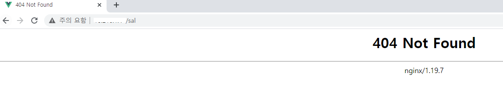

# 404 Error

## 상황



* Vue-router 를 사용하여 front 개발
* nginx나 apache 같은 웹서버 배포
* url 접근 시 `404 Not Found` 에러 발

```javascript
import Vue from "vue";
import VueRouter from "vue-router";

Vue.use(VueRouter);

const routes = [
  {
    path: "/",
    name: "Main",
    component: () => import(/* webpackChunkName: "main" */ "../views/Main.vue")
  },
  {
    path: "/sal",
    name: "salMain",
    component: () => import(/* webpackChunkName: "main" */ "../sal/views/Main.vue")
  }
];

const router = new VueRouter({
  mode: "history",
  base: process.env.BASE_URL,
  routes
});

export default router;

```

## 원인

단일 페이지 클라이언트 앱이기 때문에 사용자가 직접 `http://서버주소/sal` 에 접속하면 404 오류가 발생합니다. 

nginx의 root 경로 기준으로 컨텐츠를 찾으려고 하기 때문에 발생한 오류입니다. 예를 들어 nginx  root 경로가 /usr/html 이라고 한다면 `http://서버주소/user`로 요청이 왔을 때, nginx는 /user/html 하위의 user라는 파일을 찾게 됩니다.

## 해결

nginx의 설정이 필요

```javascript
location / {
  try_files $uri $uri/ /index.html;
}
```

 요청한 url이 정적 컨텐츠와 일치하지 않으면 index.html 을 제공하라는 의미

## 출처

* [Vue Router 공식문서](https://router.vuejs.org/kr/guide/essentials/history-mode.html#%E1%84%89%E1%85%A5%E1%84%87%E1%85%A5-%E1%84%89%E1%85%A5%E1%86%AF%E1%84%8C%E1%85%A5%E1%86%BC-%E1%84%8B%E1%85%A8%E1%84%8C%E1%85%A6)
* [초보개발자 깡냉스 | 2020. 7. 23. 22:43 | 뷰(Vue) nginx 서버 설정](https://cornswrold.tistory.com/439)
